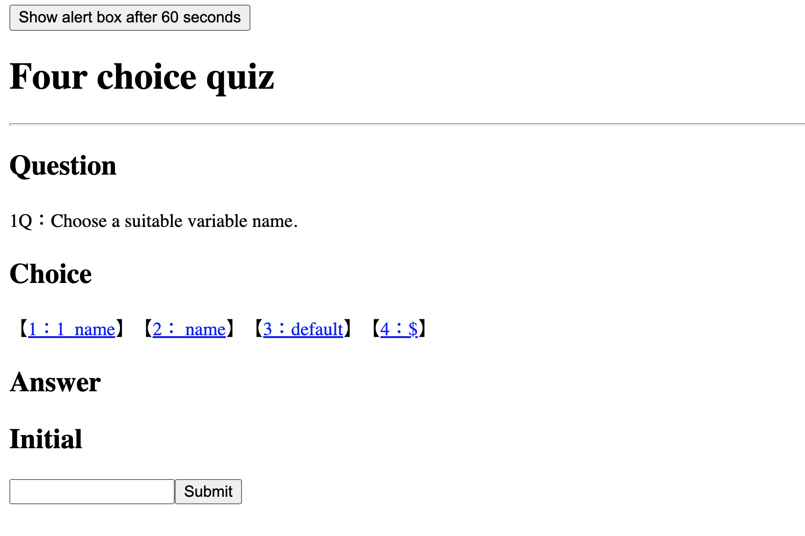

Folder update content:
Update date：July 23, 2020

URL:https://miosagawa.github.io/02_Four-Choice-Quiz/Assets/index.html
Github:https://github.com/miosagawa/02_Four-Choice-Quiz

This quiz has ten questions. The user's score is based on the percentage of questions answered correctly. The questions are based on JavaScript essentials.

Unfortunately I didn't have enough time to include a timer or saved score system. I was halfway finished with these features before I ran out of time.

    __Project sample:__

